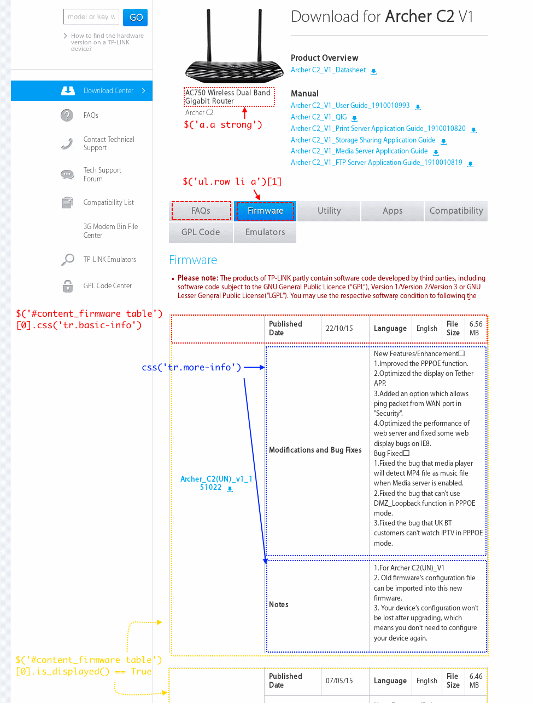

# TPLink Harvest

## Headless Browser: Xvfb
- You can run Firefox browser on an Ubuntu Server without GUI Desktop.

[](TPLink_use_Xvfb_headless_browser.png "Use Xvfb to launch Headless Browser Firefox on Ubuntu Server without Desktop GUI")

- Below script can setup your server (without GUI Desktop) run Firefox

```sh
sudo apt-get install xvfb
sudo apt-get install xfonts-100dpi xfonts-75dpi xfonts-scalable xfonts-cyrillic

export DISPLAY=:1
Xvfb :1 -screen 0 1920x1080x24 &
```
- Then try to run firefox and check whether your firefox running without abort.

```sh
firefox &
ps aux | grep firefox
```

- If above task works, then use Selenium to launch Firefox in IPython environment.


```python
from selenium import webdriver
driver = webdriver.Firefox()
```

## Enumerate models

Below Youtube Video teaches you how to use Firefox "Element Inspector" (Ctrl-Shift-I) and Firebug (F12) to get CSS Selector of the items you want to enumerate 
[](https://www.youtube.com/watch?v=C-h9QthlYyU "Use Firefox Inspector and Firebug")

- After copying "Unique CSS Selector", you get "$('div.list:nth-child(1) > ul:nth-child(9) > li:nth-child(1) > span:nth-child(1) > a:nth-child(1)')". 
- The above CSS Selector cannot select all the models appear in the page, we can simplify it to "$('.list ul li span a')" by removing certain ":nth-child(i)"
- [CSS Selectors Reference](http://www.w3schools.com/cssref/css_selectors.asp) tells you the differnce between "div > p" and "div p"

```python
CSS = driver.find_element_by_css_selector # select single one element
CSSs = driver.find_elements_by_css_selector # select multiple elements
models= CSSs('.list ul li span a')
```

## Enumerate tables (one file per table)

```python
# choose support type='Firmware'
In [15]: CSSs('ul.row li a')[1].text
Out[15]: 'Firmware'

In [16]: CSSs('ul.row li a')[1].click()

# basic-info, split by '\n' newline
In [19]: CSSs('#content_firmware table')[0].find_element_by_css_selector('tr.basic-info').text
Out[19]: 'Archer_C2(UN)_v1_151022\nPublished Date\n22/10/15\nLanguage\nEnglish\nFile Size\n6.56 MB'

In [20]: print(_19)
Archer_C2(UN)_v1_151022
Published Date
22/10/15
Language
English
File Size
6.56 MB

# first more-info
In [21]: CSSs('#content_firmware table')[0].find_element_by_css_selector('tr.more-info').text
Out[21]: 'Modifications and Bug Fixes\nNew Features/Enhancement：\n 1.Improved the PPPOE function.\n2.Optimized the display on Tether APP.\n 3.Added an option which allo ws ping packet from WAN port in "Security".\n 4.Optimized the performance of web server and fixed some web display bugs on IE8.\nBug Fixed：\n1.Fixed the bug that media player will detect MP4 file as music file when Media server is enabled.\n 2.Fixed the bug that can\'t use DMZ_Loopback function in PPPOE mode.\n3.Fixed the bug that UK BT customers cant watch IPTV in PPPOE mode.'


# second more-info
In [24]: CSSs('#content_firmware table')[0].find_elements_by_css_selector('tr.more-info')[1].text
Out[24]: "Notes\n1.For Archer C2(UN)_V1\n2. Old firmware’s configuration file can be imported into this new firmware.\n3. Your device’s configuration won't be lost aer upgrading, which means you don't need to configure your device again."

# productName
In [50]: CSS('a.a strong').text
Out[50]: 'AC750 Wireless Dual Band Gigabit Router'

# download_url
In [31]: CSSs('#content_firmware table')[0].find_element_by_css_selector('a').get_attribute('href')
Out[31]: 'http://www.tp-link.com/res/down/soft/Archer_C2(UN)_v1_151022.zip'

# Table0 is displayed
In [47]: CSSs('#content_firmware table')[0].is_displayed()
Out[47]: True

# Table[4] is not displayed
In [48]: CSSs('#content_firmware table')[3].is_displayed()
Out[48]: False

```

## Revision Select
Below is a Twitter Bootstrap style Dropdown list, not a HTML Select. Selenium Select is unable to select it. We have to click on this control so as to make hidden items ('#dlDropDownBox dd ul li a') visible.


```python
In [138]: CSS('#dlDropDownBox > dd:nth-child(2) > p:nth-child(1) > span:nth-child(1)').click()

In [139]: [_.text for _ in CSSs('#dlDropDownBox dd ul li a')]
Out[139]: ['V3', 'V2', 'V1']

In [140]: CSSs('#dlDropDownBox dd ul li a')[2].text
Out[140]: 'V1'

In [141]: CSSs('#dlDropDownBox dd ul li a')[2].click()

In [142]: driver.current_url
Out[142]: 'http://www.tp-link.com/en/download/TL-MR3420_V1.html'

```

## Tree Hierarchy of TPLink Website

In order to go to TL-MR3420, revision V2, you have to do select 4 times.
- Market -> Model -> Revision -> File


Therefore, we have a 4-level height Tree.


- Model "TL-MR3420" has 3 revisions, and revision V2 has 3 files (tables).
- If you want to continue from revision V2, second file of TL-MR3420, you can specify arguments 

```sh
python3 -u tplink_harvest.py 0, 1, 1, 1
```
- The below argument is read as "start from 0th market (home), 1th model, 1th revision, 1th file"
- (The actual index of TL-MR3420 could not be 1th, please be noted)

## Common Pitfalls of Selenium Webdriver

### StaleElement (StaleElementReferenceException)

When you `driver.back()` to the previous page, you have to `driver.find_elements_by_css_selector()` again.


### TimeoutException, NoSuchElementException

- It depends. You can use `ipdb.set_trace()` to entering interactive python debugger when encounter exceptions, and then use `driver.save_screenshot('1.png')`  to see the screenshot of the webpage. If the WebElement really shows up in the web page. Then it must be the synchronization problem.

- Webdriver runs asynchronously with python script. you have to use polling and wait for a specific Web Element.

- There are many `waitXXX` functions in [harvest_utils.py](harvest_utils.py) script.For example, waitVisible()
```python
def waitVisible(css:str, timeOut:float=30, pollFreq:float=2.0) -> WebElement :
    global driver
    wait = WebDriverWait(driver, timeOut, poll_frequency=pollFreq)
    return wait.until(EC.visibility_of_element_located((By.CSS_SELECTOR,css)))
```

- For example, in `revisionWalker()`, we use `waitVisible()` to get dropdown Widget, the time out is 9 second, and polling interval is 0.4. `TimeoutException` will be raised if such Revision dropdown is really on this page.
```python
try:
    dropdown=waitVisible('#dlDropDownBox dd:nth-child(2) p span',9,0.4)
except (TimeoutException,NoSuchElementException):
    ulog('no revision dropdown, trail=%s'%prevTrail)
```

